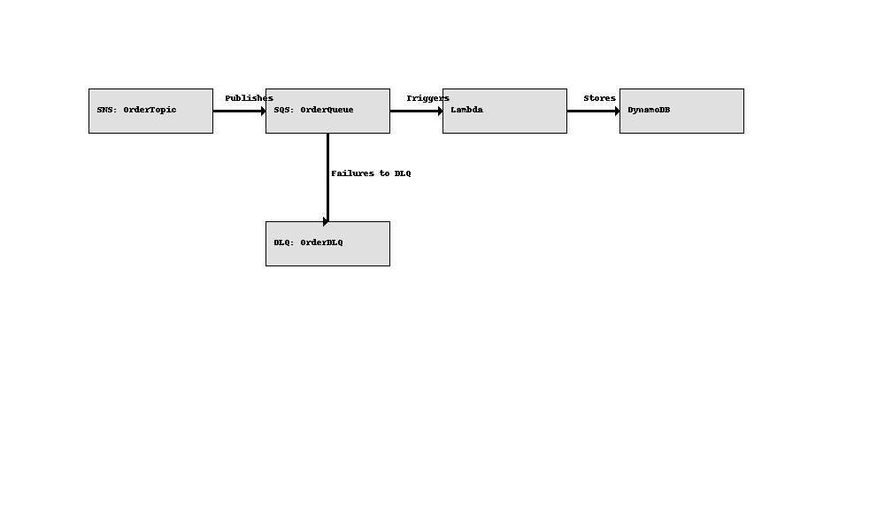
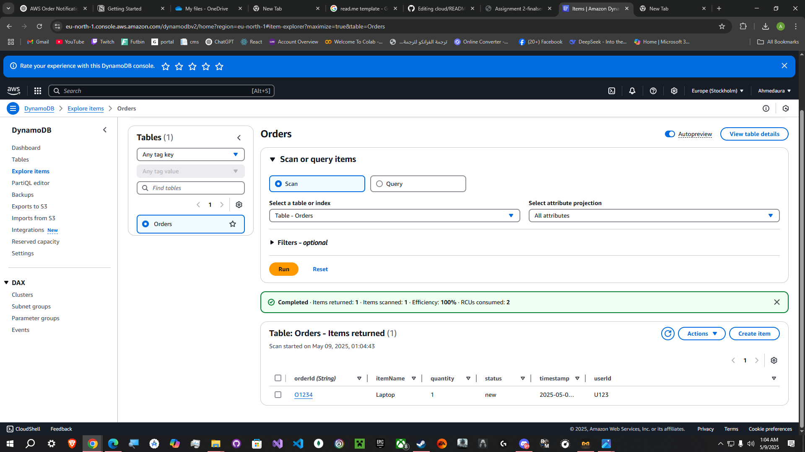
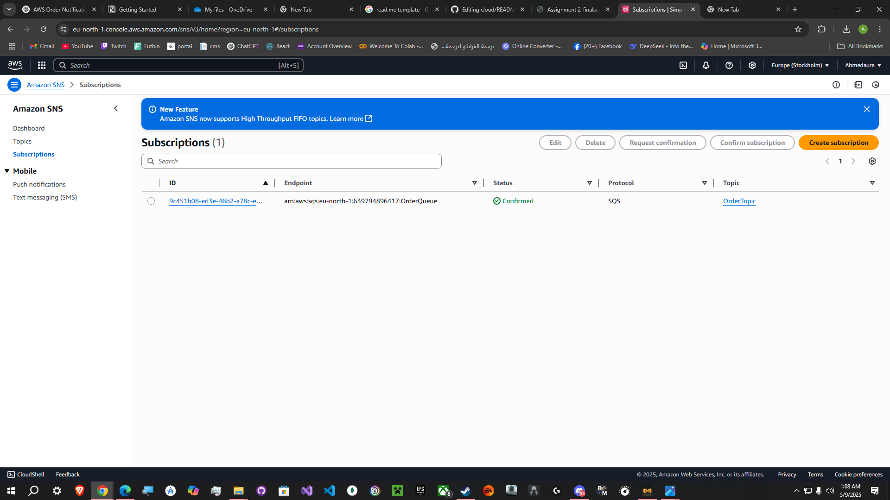
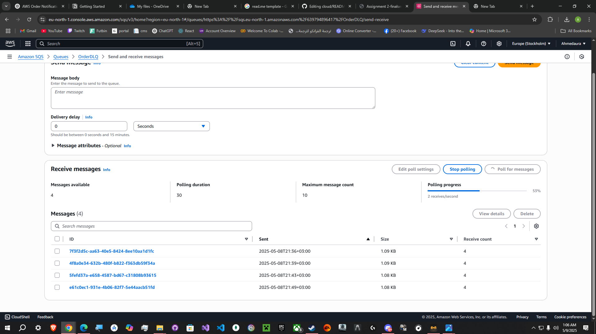
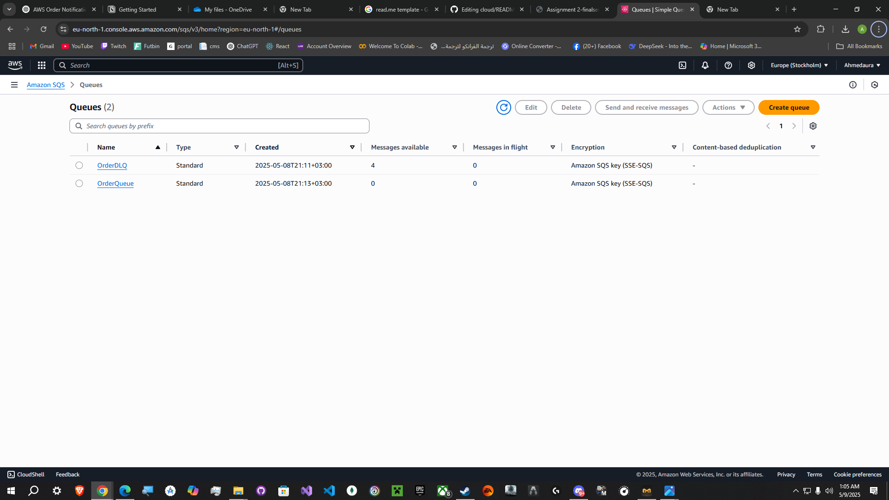
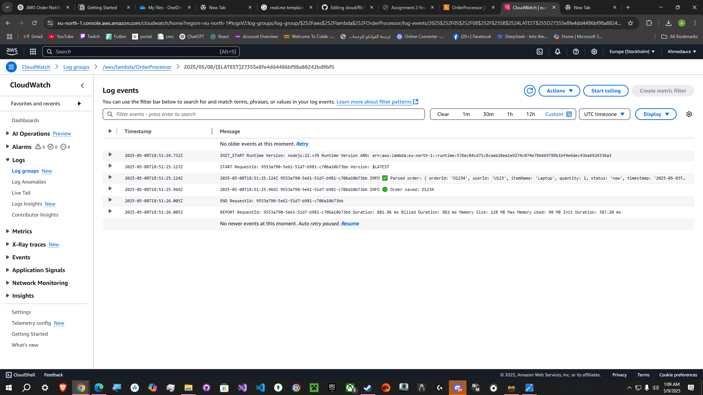

# AWS Event-Driven Order Notification System

This serverless system uses AWS to handle order events, store them in a database, and process them via messaging services. It's designed using SNS, SQS, Lambda, and DynamoDB.

# Ahmed Tamer tut16 10004773

---

## ✅ Architecture Overview

### Components:
- **SNS**: Publishes new order notifications.
- **SQS**: Queues messages for processing.
- **Lambda**: Consumes from SQS and stores data.
- **DynamoDB**: Stores order info.
- **DLQ**: Captures messages that fail >3 times.



---

## ⚙️ Setup Instructions

### Step 1: DynamoDB Table
- Name: `Orders`
- Partition key: `orderId` (String)

### Step 2: SNS Topic
- Name: `OrderTopic`

### Step 3: SQS Queues
- Create `OrderQueue` (Standard)
- Create `OrderDLQ`
- Link DLQ with `maxReceiveCount = 3`

### Step 4: Subscription
- Subscribe `OrderQueue` to `OrderTopic`

### Step 5: Lambda Function
- Name: `OrderProcessor`
- Runtime: **Node.js**
- IAM: Allow access to DynamoDB + SQS
- Trigger: `OrderQueue`
###Dummy test:
CopyEdit 
{ 
"orderId": "O1234", 
"userId": "U123", 
"itemName": "Laptop", 
"quantity": 1, 
"status": "new", 
"timestamp": "2025-05-03T12:00:00Z"
}
- Code:
```ts
import { DynamoDBClient } from "@aws-sdk/client-dynamodb"; 
import { DynamoDBDocumentClient, PutCommand } from "@aws-sdk/lib-dynamodb"; 

const client = new DynamoDBClient({}); 
const docClient = DynamoDBDocumentClient.from(client); 

export const handler = async (event) => { 
    for (const record of event.Records) { 
        try { 
            const snsMessage = JSON.parse(record.body); 
            const order = JSON.parse(snsMessage.Message); 
            console.log("✅ Parsed order:", order); 
            const params = { 
                TableName: "Orders", 
                Item: { 
                    orderId: order.orderId, 
                    userId: order.userId, 
                    itemName: order.itemName, 
                    quantity: order.quantity, 
                    status: order.status, 
                    timestamp: order.timestamp 
                } 
            }; 
            await docClient.send(new PutCommand(params)); 
            console.log(`🟢 Order saved: ${order.orderId}`); 
        } catch (err) { 
            console.error("❌ Failed to process order:", err); 
        } 
    } 
};

```
## 🧠 Visibility Timeout & DLQ Explanation

### ✅ Visibility Timeout

Visibility timeout in Amazon SQS ensures that once a message is received by a consumer (e.g., Lambda), it becomes temporarily invisible to prevent duplicate processing.

- In this system, when the Lambda function reads a message from `OrderQueue`, the message becomes hidden for the duration of the timeout.
- If the Lambda function fails (e.g., due to parsing errors), the message becomes visible again after the timeout period, allowing it to be retried.
- This guarantees **at-least-once delivery** and protects against **race conditions** or duplicate handling.

### ✅ Dead-Letter Queue (DLQ)

A Dead-Letter Queue is used to capture and isolate messages that consistently fail.

- `OrderDLQ` is configured as the DLQ for `OrderQueue` with `maxReceiveCount = 3`.
- If the same message fails to be processed 3 times, it is moved to `OrderDLQ`.
- This prevents the system from getting stuck retrying bad messages indefinitely.
- Messages in the DLQ can be inspected manually, allowing developers to analyze failures and reprocess valid ones later.

### 🔒 Benefit

Using both visibility timeout and DLQ ensures system resilience:
- Prevents message loss
- Ensures graceful failure handling
- Supports easier debugging and recovery

### 📷 Screenshots






